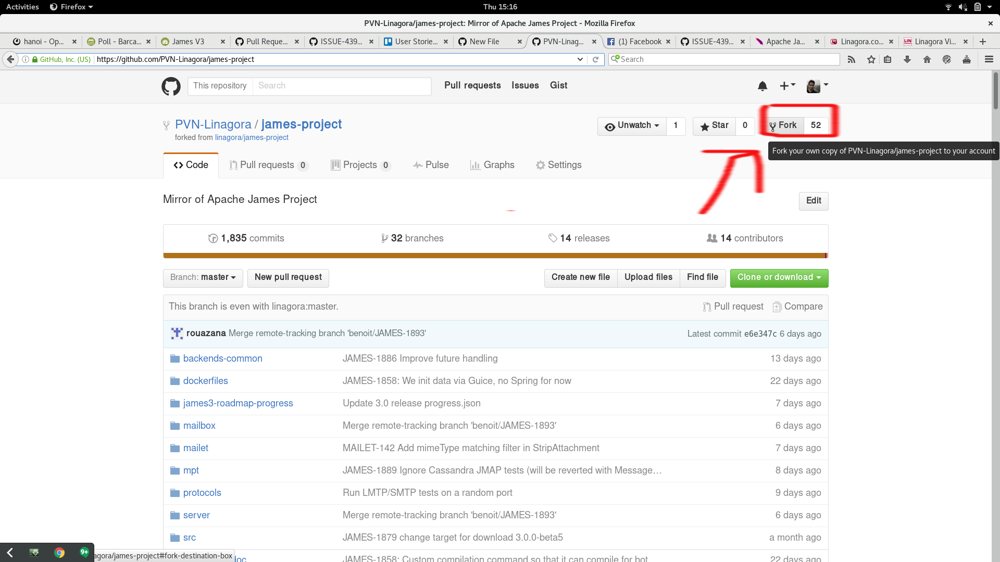
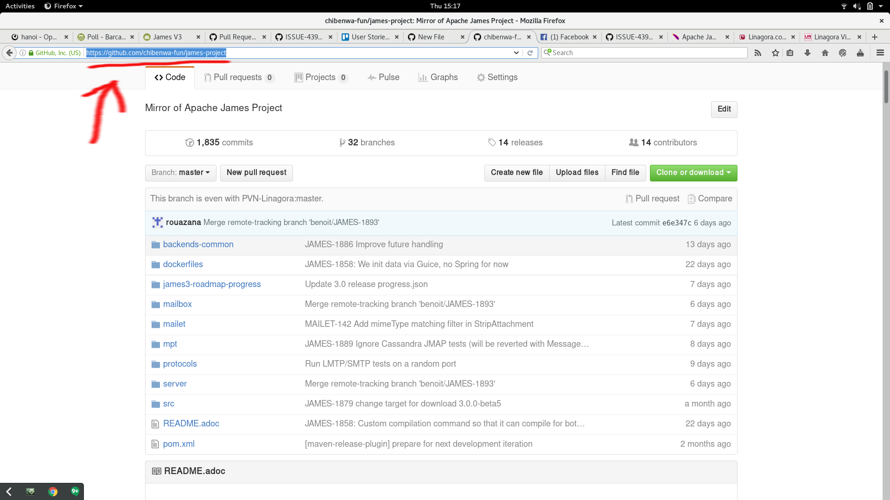
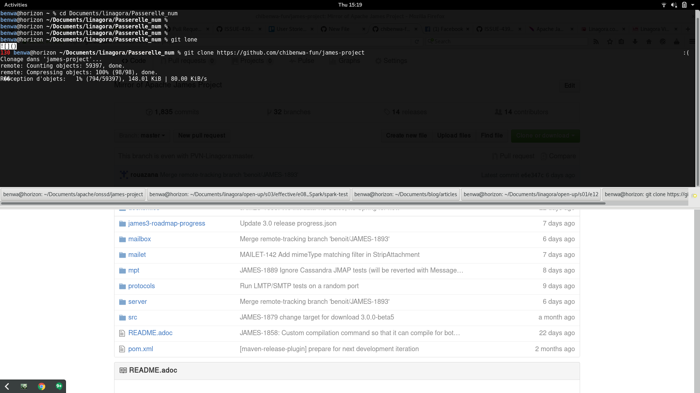
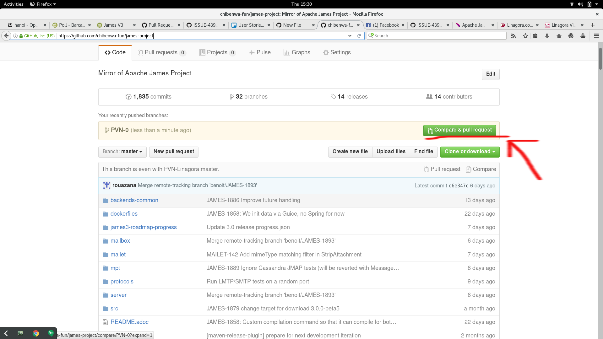
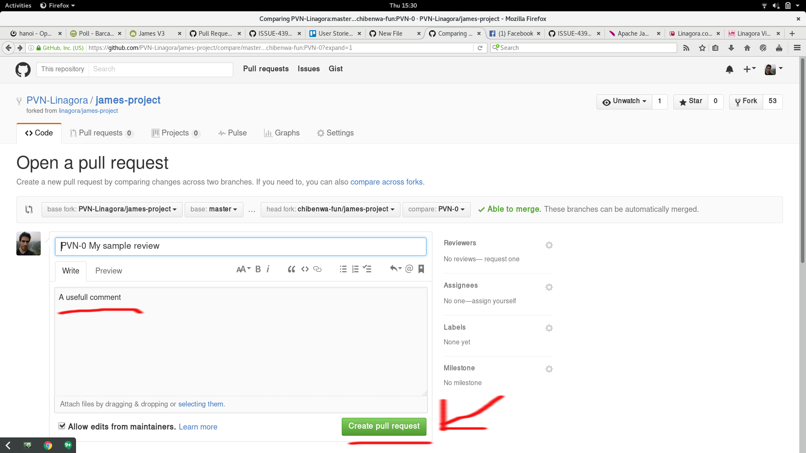
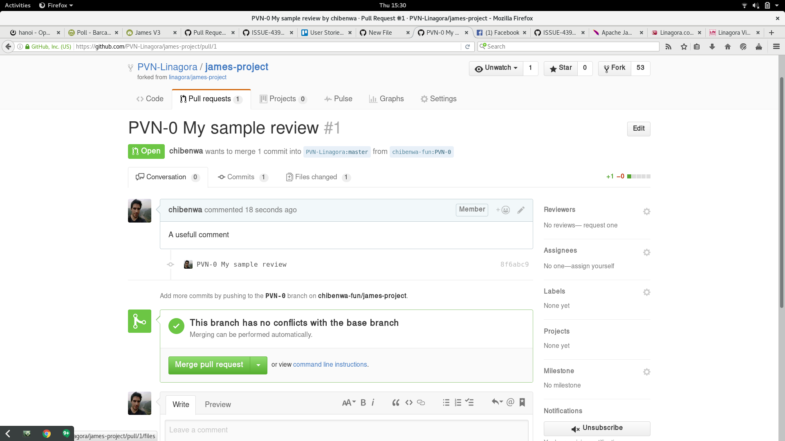
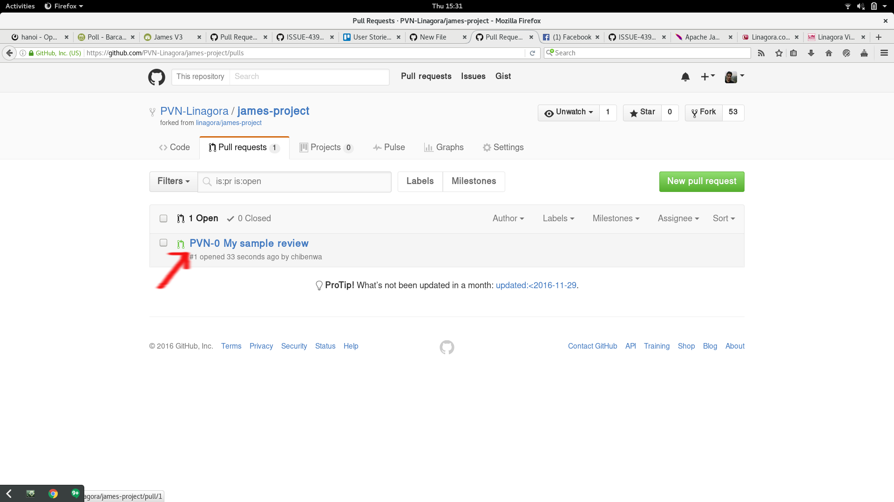
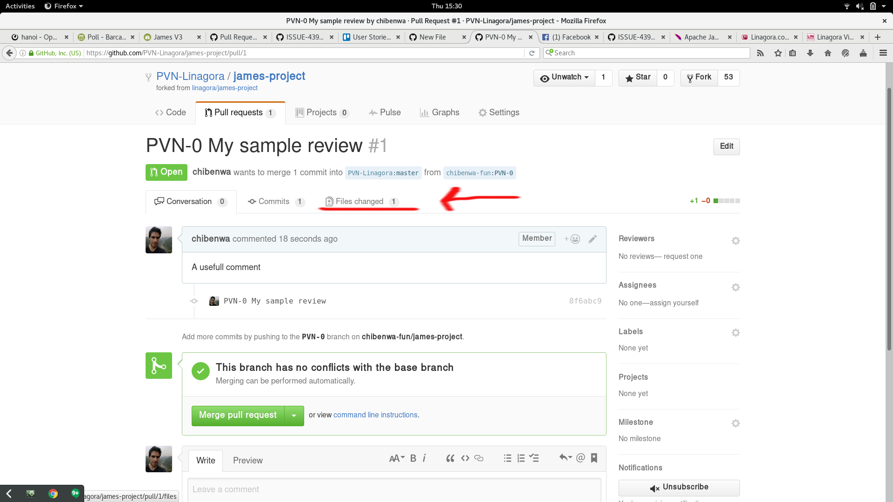
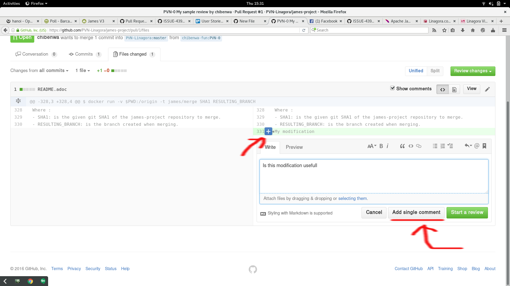

# Github

We will use **Github** to work together. This small tutorial explains how to open pull requests.

------------------------------------------

 - 1/ Visit https://github.com/PVN-Linagora/james-project
 
 - 2/ Click the fork button : 
 

 
  - 3/ Copy the URL :



  - 4/ Clone the repository : 
  
 ```
 git clone https://github.com/<your-username>/james-project
 cd james-project
 ```
 


 - 5/ Create the branch PVN-0
 
 ```
 git checkout origin/PVN-0
 ```
 
 - 6/ Modify the README

```
echo "My modification" >> README.adoc
```

 - 7/ Commit the README

```
git status
git add REAME.adoc
git commit -m "PVN-0 My sample review"
```

 - 8/ Push your changes

```
git push origin PVN-0
```

 - 9/ View your repository



 - 10/ Open a pull request





 - 11/ See the list of other pull requests: [https://github.com/PVN-Linagora/james-project/pulls](https://github.com/PVN-Linagora/james-project/pulls)



 - 12/ View the modifications of the pull request :
 


 - 13/ Make a comment :


